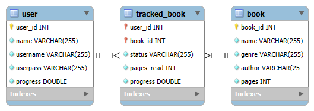

# BookMark API - Cognixia Capstone Project
This is the Backend API of a Java Maven project built for JDBC to interact with SQL as a capstone for Cognixia Future Horizons. This project stores a database of users, trackers and books, and allows users to manage a list of books that they have read, are currently reading, or plan to read. This will allow the user to see their progress with their reading list through a console-based interface.

---

## Project Objective

To create a functional and secure backend application proof-of-concept to maintain persistent data of multiple users and allows each user to create and track a list of books, all using MySQL. This project is an example of my capabilities with SQL and back-end development and can act as a framework for more advanced software design.

---

## Features
- **Login system for accessing different accounts**
- **Add books to your reading list from a selection of books in the database**
- **Keep track of your reading progress in each book and view your total progress throughout your list**
- **Make changes to your account**
- **Admin account may add and manage users and books in the available list**
- **Includes custom exceptions and documentation**

---

## Entity Relationship Diagram



---

## How to Run

*(You will need MySQL or a similar SQL platform with an active instance server, at least version 8 of Java and at least version 3 of Maven to run this application.)*

1. **Clone the project**
Using git via a unix terminal or Git Bash, enter the following while in the folder you want to store this project in:
```bash
   git clone https://github.com/zhcoburn/BookMark.git
   cd BookMark
   ```

2. **Set up the Database**
Using the MySQL workbench (another SQL client may work, too), run `bookmark_db.sql`.

3. **Configure server settings**
- Open the file in the following path using a text editor or Java IDE: 
`bookmark\src\main\java\com\coburn\fh\connection\ConnectionManager.java`.
- Change the URL, username and password for server access to match your database url and localhost root credentials.
- Be sure to save your changes!

4. **Run the program**
- Navigate to `bookmark\` using a terminal.
- Execute the following command: `mvn exec:java`
- The program should now be running on your console!

---

## Additional Notes

- **The default username and password for the admin account is "root" and "rootroot", respectively.** You can use this account to add, modify or delete users and books.
- **An example account is provided with the username "user" and the password "password".** You can use this account to test out managing your reading list, tracking progress, and editing account details.
- The user's total progress for the reading list is displayed along with their list of tracked books.
- Sample code from Cognixia Future Horizons was used to create the ConnectionManager class, but all other files were originally coded by me.

---

## Tools Used
- **Maven**
- **MySQL**
- **Microsoft Visual Studio Code**
- **Java SDK 22**
- **JDBC**
- **Github (obviously)**

---

## Special Thanks

Thank you to my instructor, Matthew Truelove, and the entire team at Cognixia Future Horizons for this opportunity to expand and explore my skills with Java backend development and the helpful instruction, examples and lessons along the way, and thank you to my fellow classmates for your collaborative efforts and inspiration!

